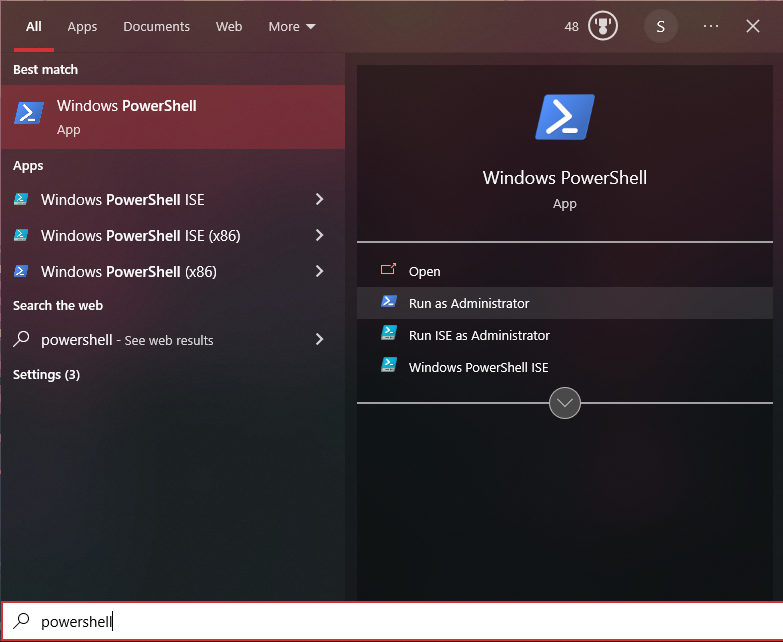
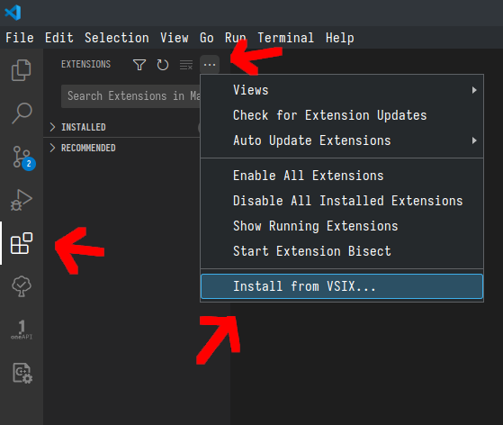
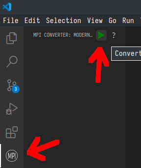

# Anleitung zur Nutzerstudie für die Masterarbeit "Ein IDE Plugin für Automatische MPI Code Modernisierung"

## 1. Voraussetzungen

Sie benötigen die folgenden Programme zur Teilnahme an der Umfrage:

-   [Visual Studio Code](https://code.visualstudio.com/)
-   Ein C++ Compiler, zum Beispiel [gcc](https://gcc.gnu.org/)
-   Eine MPI Library, zum Beispiel [OpenMPI](https://www.open-mpi.org/)

### Installieren:

#### Windows

1.  Laden Sie Visual Studio Code von [hier](https://code.visualstudio.com/Download) herunter und installieren Sie es.
2.  Installieren Sie einen C++ Compiler und eine MPI Library. Wenn Sie bereits einen C++ Compiler mit MPI haben, machen Sie mit schritt [3] weiter.
    Ansonsten empfehlen wir, [Windows Subsystem for Linux](https://learn.microsoft.com/en-us/windows/wsl/about) zu nutzen.
    Führen Sie dafür folgende Schritte aus:

    1. Öffnen Sie die Windows PowerShell als Administrator.

    

    2. Führen Sie den Befehl `wsl --install` aus.
    3. Die Installation dauert nun einen Moment.
    4. Nachdem die Installation fertig ist Rebooten Sie ihren Computer
    5. Ein Fenster mit dem Titel Ubuntu sollte sich nach dem Login automatisch öffnen und den Installationsprozess fortsetzen.
    6. Warten Sie etwas, bis Sie nach einem Nutzernamen gefragt werden.
    7. Geben Sie ein Nutzernamen und ein Passwort an. Diese dienen als Account für das Linux Subsystem.
    8. Nachdem Ubuntu fertig installiert ist, kann mit den folgenden Befehlen gcc und openMPI installiert werden.

        `sudo apt-get update`

        `sudo apt-get install gcc make openmpi-bin g++ libopenmpi-dev`

    9. Bestätigen Sie mit 'y'
    10. Sie haben nun ein Ubuntu terminal und können dort wie mit einem Linux System arbeiten. Das System kann auch durch die PowerShell mit dem Befehl `wsl` aufgerufen werden. Dies können sie im Visual Studio Code Terminal machen, um dort dann die `make` Befehle in der Durchführung auszuführen.
        Mit `exit` wechseln Sie wieder in die gewohnte PowerShell zurück.

3.  Installieren Sie das Plugin in Visual Studio Code:

    1. Öffnen Sie Visual Studio Code und navigieren Sie in der Aktivitätenleiste auf der linken Seite zu den Erweiterungen (eng. Extensions).
    2. Wenn Sie bereits Extensions in Visual Studio Code installiert haben, kann es sinnvoll sein, die anderen Extensions zu deaktivieren.
       Dies können Sie in den Optionen auf ... im extension tab machen.
    3. Klicken Sie in dem Extension Tab auf ...
    4. Wählen Sie _Aus VSIX installieren_ / _Install from VSIX_

    

    4. Wählen Sie in dem Fileselektor die bereitgestellte _mpiconv-0.0.X.vsix_ Datei aus. Wenn Sie gefragt werden, ob sSe der Extension vertrauen, bestätigen Sie bitte.

#### Linux

1. Laden Sie Visual Studio Code von [hier](https://code.visualstudio.com/Download) herunter und installieren Sie es. Alternativ kann Visual Studio Code auch von manchen package managern installiert werden.
2. Wenn Sie noch keinen C++ Kompiler, MPI Library oder Make installiert haben, nutzen Sie Ihren package manager, um 'gcc', 'make' und 'openmpi' zu installieren.
    - Ubuntu/Debian: `sudo apt-get install gcc make openmpi-bin g++ libopenmpi-dev`
    - Arch: `sudo pacman -S gcc make openmpi`
3. Installieren Sie das Plugin in Visual Studio Code:

    1. Öffnen Sie Visual Studio Code und navigieren Sie in der Aktivitätenleiste auf der linken Seite zu den Erweiterungen (eng. Extensions).
    2. Wenn Sie bereits Extensions in Visual Studio Code installiert haben, kann es sinnvoll sein, die anderen Extensions zu deaktivieren.
       Dies können Sie in den Optionen auf ... im extension tab machen.
    3. Klicken Sie in dem Extension Tab auf ...
    4. Wählen Sie _Aus VSIX installieren_ / _Install from VSIX_

    

    5. Wählen Sie in dem Fileselektor die bereitgestellte _mpiconv-0.0.X.vsix_ Datei aus.Wenn Sie gefragt werden, ob sSe der Extension vertrauen, bestätigen Sie bitte.

## 2. Durchführung

1. Öffnen Sie den bereitgestellten Ordner _exercise1_ in Visual Studio Code. Wenn Sie gefragt werden, ob Sie dem Author des Ordners vertrauen, bestätigen Sie bitte.
2. Öffnen Sie die Datei _exercise1.cpp_.
3. Machen Sie sich etwas mit dem Code vertraut. Das Programm wendet die Funktion _function_ auf jedes Element eines Arrays an und berechnet dann die Summe aller Elemente.
   Dafür wird einer der Prozesse als Master und die anderen als Worker benutzt.
   Der Master generiert zunächst ein Array und ruft dann die Funktion _master_work_ auf.
   Dort verteilt er das Array gleichmäßig auf die Worker mit _MPI_Send_.
   Dann empfängt er die Zwischenergebnisse mit _MPI_Recv_.
   Zum Schluss berechnet er noch den Rest des Arrays und summiert alle Zwischenergebnisse auf.
   Die Worker rufen direkt die Funktion _worker_work_ auf.
   Dort empfangen Sie ihren Teil des Arrays und berechnen ihr Subergebnis.
   Sie geben ihre Zwischenergebnisse an den Master zurück und sind fertig.
   Das verteilte Ergebnis wird dann noch mit der Funktion _verfiy_ geprüft.
   Ob das Ergebnis richtig ist, oder nicht wird auf der Kommandozeile ausgegeben.
4. Testen Sie das Programm, indem Sie folgende befehle im Terminal eingeben:

    `make all`

    `make run`

    Hierfür können Sie das integrierte Terminal nutzen. Navigieren Sie dafür in das Terminal Menü und clicken Sie auf _Neues Terminal_ (_New Terminal_).
    In Windows wird dies eine PowerShell öffnen, in der Sie mit dem Befehl `wsl` ihr Linux Subsystem nutzen können.

5. Wenden Sie nun das Plugin an, indem Sie entweder das MPI Symbol links in der Aktivitätenleiste klicken und dann den grünen Pfeil anklicken, oder mit der Tastenkombination "_ctr_ + _shift_ + _p_" das Ausführfenster öffnen und "Convert MPI Statements" ausführen.

    

6. Das Plugin wird ihnen nun eine Reihe an Fragen mit dem Dialogfenster stellen. Versuchen Sie jede der 4 MPI send/recv Instruktionen mit dem Plugin zu ersetzen.

7. Testen Sie das Resultat mit den Befehlen:

    `make all`

    `make run`

8. Sollte das Programm nicht direkt kompilieren, oder das falsche Ergebnis ausrechnen, versuchen Sie die Fehler bitte manuell zu beheben.

9. Sie können optional die Schritte 1 bis 8 noch mit _exercise2_ oder Ihren eigenen MPI Programmen testen. Feedback zu Letzterem sind für die Weiterentwicklung des Plugins sehr hilfreich.

    - Zur _exercise2_: Hier finden sie den relevanten MPI code in der Datei _exercise2.cpp_. Sie können wie gewohnt mit `make all` und `make run` das Programm testen.
      In dieser exercise sind viele MPI Instruktionen, nicht alle können sinnvoll umgewandelt werden. Also ist es hier nicht notwendig alle Instruktionen zu ersetzen.

        Das Programm berechnet die Mandelbrot-Menge in einem vordefiniertem Raum. Dafür wird ein Prozess gewählt, der als Master arbeitet.
        Dieser weist jedem Worker eine X Koordinate zu. Die Worker berechnen die gesamte Spalte zu dieser X Koordinate.
        Wenn ein Worker fertig ist, schickt er die Spalte zum Master, und bekommt eine neue X Koordinate zugewiesen.
        Der Master empfängt die Spalte, verteilt eine neue X Koordinate und schreibt die Spalte in seinem Buffer.

        Nachdem alle Spalten berechnet sind, verifiziert der Master, dass das Ergebnis korrekt ist und speichert die Mandelbrot-Menge als ppm Bild.

10. Wenn Sie alle Instruktionen ersetzt haben und das Programm das richtige Ergebnis ausgibt, oder wenn Sie es nicht schaffen, das Programm nach dem Anwenden des Plugins zum Laufen zu bringen, öffnen Sie bitte den [Fragebogen](https://www.soscisurvey.de/MPIplugin2023/)\* und füllen ihn aus.

Vielen Dank, dass Sie sich die Zeit genommen haben.
Ihre Angaben und ihr Feedback tragen maßgeblich zu meiner Masterarbeit bei.

Bei Fragen oder Problemen wenden Sie sich gerne an mich: sven.donnerhak@stud.tu-darmstadt.de

\* Link: https://www.soscisurvey.de/MPIplugin2023/
