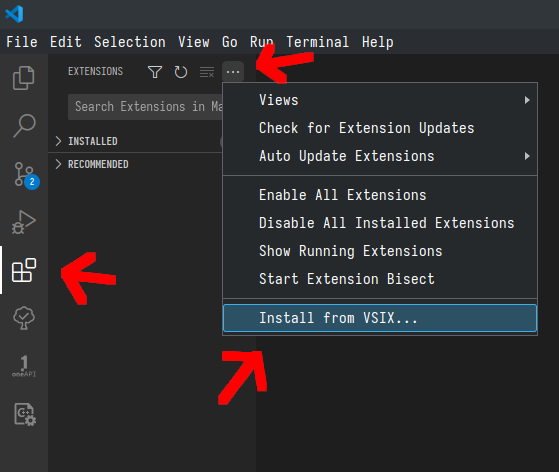

# Instructions for the User Survey for the Master Thesis "An IDE Plugin for Automatic MPI Code Modernisation"

## 1. Requirement

You need the following programs to participate in this Survey:

-   [Visual Studio Code](https://code.visualstudio.com/)
-   A C++ Compiler, for example [gcc](https://gcc.gnu.org/)
-   A MPI library, for example [OpenMPI](https://www.open-mpi.org/)

### Instalation:

#### Windows

1.  Download and install Visual Studio Code from [here](https://code.visualstudio.com/Download)
2.  Install a C++ compiler and a MPI library. If you already have a c++ compiler and a MPI library continue with step [3].
    Otherwise we recomend using [Windows Subsystem for Linux](https://learn.microsoft.com/en-us/windows/wsl/about) . 1. Open the Windows PowerShell as administrator.

        

        2. Execute the command `wsl --install` in the PowerShell
        3. The installation will take a few minutes.
        4. After the installation is done, reboot the Computer.
        5. A Ubuntu window should open automatically and the intstallation will be continue.
        6. When asked, enter a username and a password, that will serve as login for the linux subsystem.
        7. After Ubuntu is done installing, install gcc and openMPI with the following commands:

            `sudo apt-get update`

            `sudo apt-get install gcc make openmpi-bin g++ libopenmpi-dev`

        8. Confirm installation with 'y'
        9. You now have a Ubuntu terminal, that can be used as a regular linux system. You can also access this system, by typing `wsl` in the PowerShell.
        You can use this in the Visual Studio Code terminal to run the `make` commands necessary for this survey. Use `exit` to return to the usual PowerShell.

3.  Install the Visual Studio Code Plugin:

    1. Open Visual Studio Code and navigate to the _Extension_ tab in the _Activity Panel_
    2. If you allready have some Extensions installed, you may want to disable them, as they can interfere with our plugin. You can disable all extensions in the options menu ...
    3. Open the options menu by clicking ...
    4. Select _Install from VSIX_

    

    5. Locate and select the provided _mpiconv-0.0.X.vsix_ file.
       You may have to acknowledge, that you trust the author of this extension, please do so.

#### Linux

1.  Download and install Visual Studio Code from [here](https://code.visualstudio.com/Download).
    Note that many package manager allready provide visual studio code, so you can install it with that.
2.  If you do not have a C++ Compiler, MPI Library or Make, install them from the package manager or by downloading from the websides.
    Here are some package manager commands: - Ubuntu/Debian: `sudo apt-get install gcc make openmpi-bin g++ libopenmpi-dev` - Arch: `sudo pacman -S gcc make openmpi`

3.  Install the Visual Studio Code Plugin:

    1. Open Visual Studio Code and navigate to the _Extension_ tab in the _Activity Panel_
    2. If you allready have some Extensions installed, you may want to disable them, as they can interfere with our plugin. You can disable all extensions in the options menu ...
    3. Open the options menu by clicking ...
    4. Select _Install from VSIX_

    

    5. Locate and select the provided _mpiconv-0.0.X.vsix_ file.
       You may have to acknowledge, that you trust the author of this extension, please do so.

## 2. Testing the Plugin

1. Open the provided folder _exercise1_ in Visual Studio Code. You may have to acknowledge that you trust the author, please do so.
2. Open the file _exercise2.cpp_
3. Make yourself comfortable with the code.
   The program applies the function _function_ to every element of an array.
   The array is distrbiuted onto multiple processes.
   One of the processes is assigned the master.
   It initialises the array, and distriubtes the array to the worker processes.
   It then calculates its own intermediat result.
   Next it combines all intermeditate results.

The other processes are worker.
They recieve their array partition and calculate their results.
They then send the result to the master and are done.

Lastly the master process uses the function _verify_ to make sure the distribution did deliver the correct result. If it was correct or not, will then be written to the command line.

4. Test the program by running the following commands:
   `make`
   `make run`

5. Now run the Plugin, by selection the MPI symbol in the Activity Panel (on the left), and then clicking the green arrow. Alternativly you can open the run panel, by pressing "_ctrl_ + _shift_ + _p_" and run "Convert MPI Statements".

6. The plugin will guide you trough the process with a set of dialog windows.
   Please try to change all four MPI send/recv instructions into non-blocking ones.

7. Test the result by running:
   `make`
   `make run`

8. Should the programm not compile, or deliver the wrong result, try to fix the issue manually.

9. You may optionally repeat steps 1 to 8 with one of your own MPI programs.
10. If all instructions are replaced and the program passes the test, or if you can not fix the issues, please continue with the survey, you can find [here](https://www.soscisurvey.de/MPIplugin2023/)\*

Thank you for taking the time.
Your input and feedback is contributing to my thesis a lot.

If you have any questions or issues, contact me: sven.donnerhak@stud.tu-darmstadt.de

\* Link: https://www.soscisurvey.de/MPIplugin2023/?act=5QRrimP9dj9u8os5PXj33Lrz
